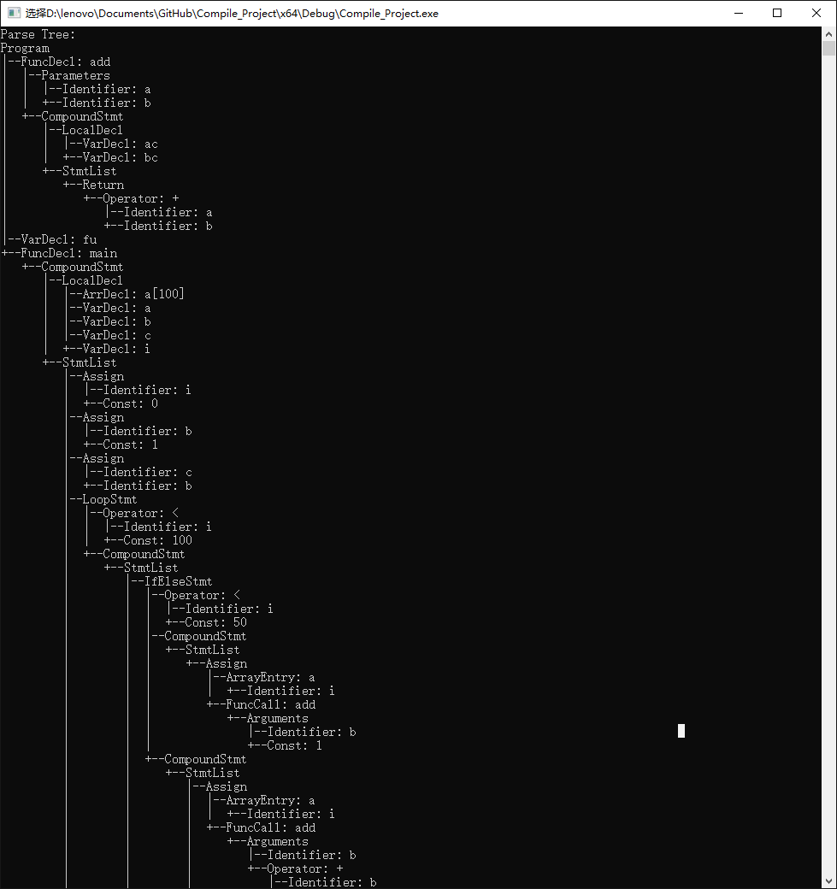
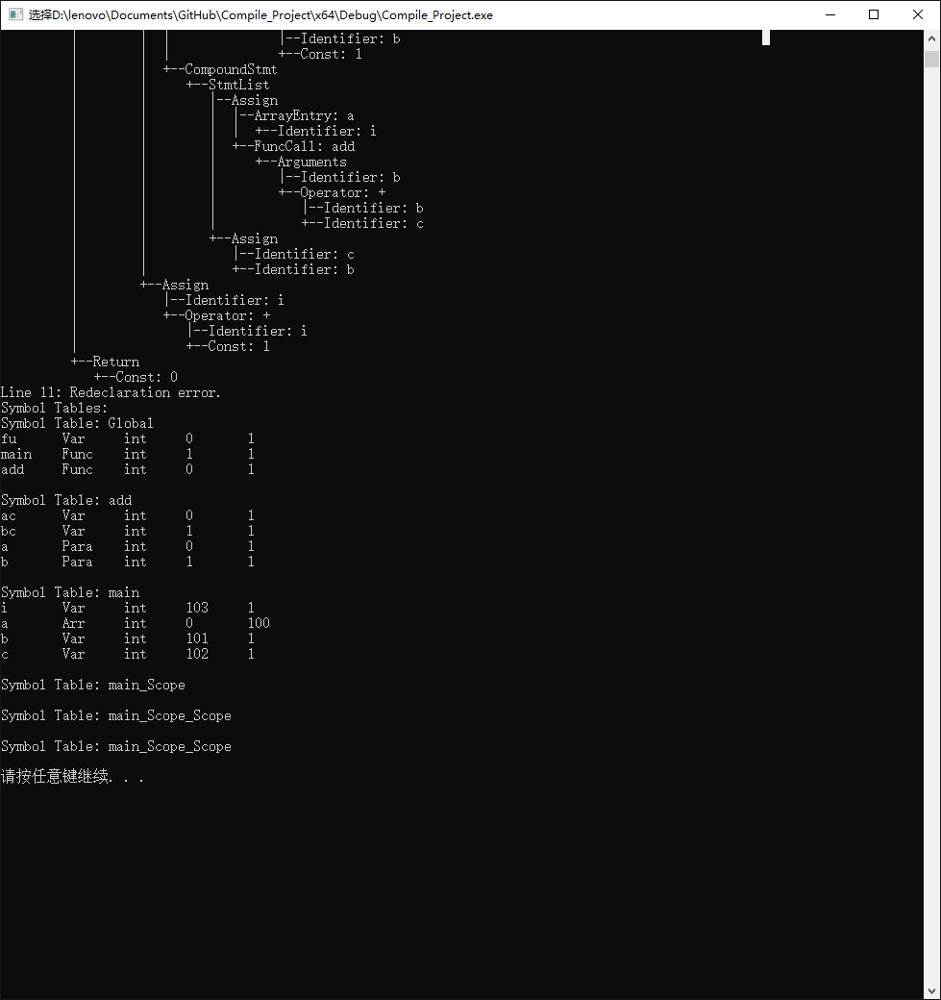

# 编译原理报告


## 1. 概述

这个实验中，我们的目的是做一个简化版C语言的编译器。这个编译器应当可以读入文件并将其中的高级语言转换成编译用的中间代码。

我们的工作分为几个部分，词法分析、语法分析、语法树生成和中间语言的生成。词法和语法的工作分别由lex和yacc的这两种工具来完成，通过对他们的定义，帮助我们自动生成语法树。


## 2. 语法设计

在进行词法和语法分析的工作之前需要对语法进行设计，以确定语言的工作方式，保证语法和语言是想对应的。我们使用的语言参考了C和C-的语法。

### 2.1 预期功能

设计语法之前，我们需要先明确这个语言应当可以接受的操作。因为这一语言是C的简化版本，所以C的基本操作应可以接受C的大部分基本操作。

我们计划的功能如下：

1. 变量的定义与赋值（变量的类型包括整数和空），其中变量根据其定义的位置可以为局部变量或是全局变量；
2. 函数的定义、实现和调用；
3. 加减乘除等四则运算；
4. 大于、小于等比较运算；
5. 与、或、非等逻辑运算；
6. if、if...else等选择语句；
7. while等循环语句；
8. return等跳转语句；

其中赋值和参数调用中也均可以使用复合运算。这些语句的格式都仿照C的格式，如else后可以直接连接一个语句，也可以通过{}在其中包含一整段程序或是再连接if形成else if的语句；if、while等语句后的（）中可以使用单个的值或是表达式作为判断的标准；while、if等语句后面不需要分号，但是do...while后面需要分号等。

对于C中的struct定义、指针运算等我们暂时不计划实现。


### 2.2 词法定义

#### 2.2.1 关键词

在设计好应当事先的功能之后，我们可以对关键词进行设计了。这一语言预期接受的关键词有:
int, void, if, else, while, for, return

#### 2.2.2 变量与值

而对于用户定义的identifier，我们要求与C一致，即第一个字符为字母（大小写均可）或下划线，之后可以出现任意字母、数字和下划线；对于用户提供的数值，除了一般的数字串和数字小数点数字串，直接省略小数点前的数字，直接从小数点开始的数字串来表示0到1之间的小数。

#### 2.2.3 运算符

因为支持运算，所以词法中还应该包含运算符的设定。这一语言接受的运算符包括：
+, -, *, /, (), {}, [], <, >, =, >=, <=, ==, !=,&&, ||, !, ;


### 2.3 语法

由于yacc使用的是LALR(1)的模式进行语法分析，所以我们的语法设计也基于这一点进行。

一个程序是由一组声明组成的，这些声明可以是函数的声明，也可以是变量的声明。在一个可用的程序中，声明至少有一个而不能为空。但是在我们这个简化的C中，不对定义和实现进行区分而要求定义和实现总是相邻。因此声明部分的语法定义如下。

```yacc
program -> declaration_list
declaration_list -> declaration declaration_list | declaration	
declaration -> var-declaration | fun-declaration
```

对于变量的声明，它可以是一个单独的变量，也可以是一个数组。在这个语法中，要求定义变量和初始化分开。支持的变量类别有int和void两种。

```yacc
var-declaration -> type-specifier ID ; | type-specifier ID [ NUM ] ;
type-specifier -> INT | VOID
```

一个函数的定义和变量类似，首先是对于函数返回值类型的声明，然后是函数的名字。在那之后是函数和变量不同的地方，即函数在后面需要附上参数的列表。在本次使用的语法中，我们要求函数的定义紧跟在其声明之后。函数可以有任意个参数，格式与一般的C一样，同时也支持以数组作为函数的参数。在声明后使用大括号括起来的函数段作为其定义部分。这样定义的函数同样可以支持函数的递归。具体规定如下：

```yacc
fun-declaration -> type-specifier ID ( params ) compound-stmt
params -> param-list | VOID
param-list -> param-list , param | param
param -> type-specifier ID | type-specifier ID [ ]
```

一个复合声明是由一组定义和声明组成的。在一个符合声明中定义的函数和变量是本地的变量，离开这个复合声明就会失效。如果在复合声明中定义了和外部相同名称的变量或是函数，那么复合声明以内将会以复合声明中定义的为准，而离开之后内部的失效以外部为准。注意本地声明和定义都可以是空的，也就是说即使复合声明为空也是符合语法的。

```yacc
compound-stmt -> { local-declarations statement-list }
local-declarations -> local-declarations local-declaration | e
statemene-list -> statement-list statement | e
```

一个表达式可以分为多种类型，即计算、复合、选择、循环、或是返回的表达式。在其中，选择表达式可以带有else部分，也可以不带else部分；同样return可以直接返回，也可以带返回值返回，这取决于函数的类型。一个void类型的函数不能返回值，而int类型的函数必须返回一个int值。

```yacc
statement -> expression-stmt | compound-stmt | selection-stmt | iteration-stmt 
			| return-stmt
expression-stmt -> expression ; | ;
selection-stmt -> if ( expression ) statement 
				| if ( expression ) statement else statement
iteration-stmt -> while ( expression ) statement
return-stmt -> return ; | return expression ;
```

表达式可以返回值，此时可以利用这个值对其他变量进行赋值。赋值的对象可以是单独的变量，也可以是数组中的一个值。

```yacc
expression -> var = expression | simple-expression
var -> ID | ID [ expression ]
```

一个简单表达式可以试一个比较，也可以是一个计算式。简单表达式的值这样定义：如果是计算，那么它的值就是加减法表达式的值；如果是关系表达式，那么在结果为真时值为1，反之为0。计算式支持四则运算，其加减法和乘除法的分析是分开进行分析的；同样也支持括号的使用，和带入变量。

```yacc
simple-expression -> additive-expression relop additive-expression
					| additive-expression
relop -> <= | < | > | >= | == | !=
additive-expression -> additive-expression addop term | term
addop -> + | -
term -> term mulop factor | factor
mulop -> * | /
factor -> ( expression ) | var | call | NUM
```

同样在算式中可以带入定义了的函数。函数的调用就是使用函数名加参数列表。参数是任意的表达式，即可以带入数字、变量或是调用其他函数。对于不需要参数的函数，括号中可以为空。

```yacc
call -> ID ( args )
args -> arg-list | e
arg-list -> arg-list , expression | expression
```

完整版本的语法请见附录1。


## 3. 词法分析

由上面的定义，我们就可以写出具体lex使用的词法了。由之前的分析可知，对于我们的语言来说，定义其词法应说搜换船；该是

作业纸序号词法具体的定义如下：

```lex
/* Basic symbol spcification */
digit [0-9]
letter [A-za-z]
id ({letter}{letter|digit}*)
num {digit}+
whitespace [ \t\r]+

 /* Keywords Specification */
"int" "if" "else" "while" "return" "void"
 /* Symbols Specification */
"(" ")" "[" "]" "{"	"}"
/* Identifier and numbers */
[a-zA-Z]+	{yylval.name=strdup(yytext);return(ID);}
[0-9]+		{yylval.value=atoi(yytext);return(NUM); }

 /* Numerical Arithmetic Operators */
"+"	"-" "*" "/"
 /* Relative Operators */
"<"	"<=" ">" ">=" "==" "!="
 /* Assign Operator */
"="
 /* Statement Delimiter */
";" ","
```


## 4. 语法分析与语法树的生成

### 4.1 语法树的设计

因为语法树中每个节点对应的语句不通，语法也不同，所以每个非叶节点都有可能由不同数量的子节点。在这样的情况下，语法树如果设计为子节点数目确定的树是浪费资源而不合理的。因此，我们将语法树设计为父子树，每个节点只记录自己的儿子数量、长子指针和自己的下一个兄弟，这样父亲就可以通过长子访问到自己的所有子节点。


```c
/* Syntax tree node */
typedef struct STNode STNode;
struct STNode
{
	STNode * brother; // the younger brother of this node
	STNode * child; // the first son of this node
	STNode * father; // the number of children of this node
	int No_Line; // the line number of the token or word
	char name[20]; // the name of this node
	kind kind;
	nodetype type; // use for type checking
	nodeattr attr; 
};
```

再这个基础之上，通过insert()函数来负责将节点插入父节点中，以及printSTree()函数将语法树打印。

```c
/* 
Function insert() will insert the node newchild into the node father as the last of it's sons.
*/
int insert(STNode *father, STNode *newchild)
{
	if (!(newchild && father))
		return 1;
	newchild->father = father;
	if (father->child == NULL)
	{
		father->child = newchild;
		return 0;
	}
	else
	{
		STNode* focus = father->child;
		while (focus->brother)
		{
			focus = focus->brother;
		}
		focus->brother = newchild;
		return 0;
	}
}

/*
Function printSTree() will output the tree pointed by the pointer root.
it will print the tree node name and put several "__" before accroding to the node's level. This function is realized through recursive way
*/
void printSTree(STNode* node, int level)
{
	if (node->brother) node->brother->father = node->father;
	STNode *father = node->father;
	listnode *tail = NULL;
	if (father)
		while (father->father)
		{
			listnode *temp = (listnode*)malloc(sizeof(listnode));
			temp->next = tail;
			temp->data = father->brother ? 1 : 0;
			tail = temp;
			father = father->father;
		}
	while (tail)
	{
		if (tail->data)
			printf("|  ");
		else
			printf("   ");
		tail = tail->next;
	}
	if (level > 0) {
		if (node->brother)
			printf("|--");

		else
			printf("+--");
	}
	printf("%s\n", node->name);
	STNode* focus = node->child;
	while (focus)
	{
		printSTree(focus, level + 1);
		focus = focus->brother;
	}
	return;
}
```


## 标号。测试

对编译器进行测试，测试代码如下：

```C
int add(int a, int b){
	int ac;
	int bc;
	return a+b;
}

int fu;

int main(){
	int a[100];
	int a;
	int b;
	int c;
	int i;
	i = 0;
	b = 1;
	c = b;
	while (i < 100){
		if (i < 50){
			a [i] = add(b, 1);
		}else{
			a [i] = add(b, b + c);
			c = b;
		}
		i = i + 1;

	}
	return 0;
}
```

编译器对以上代码进行编译，输出其语法树和分析结果：





输出文件result.txt：

	Starting parse
	Entering state 0
	Reading a token: Next token is token INT ()
	Shifting token INT ()
	Entering state 1
	Reducing stack by rule 9 (line 94):
	   $1 = token INT ()
	-> $$ = nterm type ()
	Stack now 0
	Entering state 7
	Reading a token: Next token is token ID ()
	Shifting token ID ()
	Entering state 11
	Reading a token: Next token is token '(' ()
	Shifting token '(' ()
	Entering state 13
	Reading a token: Next token is token VOID ()
	Shifting token VOID ()
	Entering state 18
	Reading a token: Next token is token ')' ()
	Reducing stack by rule 13 (line 132):
	   $1 = token VOID ()
	-> $$ = nterm paras ()
	Stack now 0 7 11 13
	Entering state 20
	Next token is token ')' ()
	Shifting token ')' ()
	Entering state 26
	Reducing stack by rule 11 (line 113):
	   $1 = token ID ()
	   $2 = token '(' ()
	   $3 = nterm paras ()
	   $4 = token ')' ()
	-> $$ = nterm func ()
	Stack now 0 7
	Entering state 12
	Reading a token: Next token is token '{' ()
	Shifting token '{' ()
	Entering state 16
	Reducing stack by rule 20 (line 201):
	-> $$ = nterm local_decls ()
	Stack now 0 7 12 16
	Entering state 24
	Reading a token: Next token is token RETURN ()
	Reducing stack by rule 22 (line 216):
	-> $$ = nterm stmt_list ()
	Stack now 0 7 12 16 24
	Entering state 31
	Next token is token RETURN ()
	Shifting token RETURN ()
	Entering state 43
	Reading a token: Next token is token NUM ()
	Shifting token NUM ()
	Entering state 40
	Reducing stack by rule 58 (line 455):
	   $1 = token NUM ()
	-> $$ = nterm factor ()
	Stack now 0 7 12 16 24 31 43
	Entering state 55
	Reducing stack by rule 52 (line 429):
	   $1 = nterm factor ()
	-> $$ = nterm term ()
	Stack now 0 7 12 16 24 31 43
	Entering state 54
	Reading a token: Next token is token ';' ()
	Reducing stack by rule 48 (line 405):
	   $1 = nterm term ()
	-> $$ = nterm add_expr ()
	Stack now 0 7 12 16 24 31 43
	Entering state 53
	Next token is token ';' ()
	Reducing stack by rule 40 (line 377):
	   $1 = nterm add_expr ()
	-> $$ = nterm simple_expr ()
	Stack now 0 7 12 16 24 31 43
	Entering state 52
	Reducing stack by rule 36 (line 340):
	   $1 = nterm simple_expr ()
	-> $$ = nterm expr ()
	Stack now 0 7 12 16 24 31 43
	Entering state 64
	Next token is token ';' ()
	Shifting token ';' ()
	Entering state 87
	Reducing stack by rule 33 (line 311):
	   $1 = token RETURN ()
	   $2 = nterm expr ()
	   $3 = token ';' ()
	-> $$ = nterm retn_stmt ()
	Stack now 0 7 12 16 24 31
	Entering state 49
	Reducing stack by rule 27 (line 227):
	   $1 = nterm retn_stmt ()
	-> $$ = nterm stmt ()
	Stack now 0 7 12 16 24 31
	Entering state 45
	Reducing stack by rule 21 (line 208):
	   $1 = nterm stmt_list ()
	   $2 = nterm stmt ()
	-> $$ = nterm stmt_list ()
	Stack now 0 7 12 16 24
	Entering state 31
	Reading a token: Next token is token '}' ()
	Shifting token '}' ()
	Entering state 36
	Reducing stack by rule 18 (line 180):
	   $1 = token '{' ()
	   $2 = nterm local_decls ()
	   $3 = nterm stmt_list ()
	   $4 = token '}' ()
	-> $$ = nterm comp_stmt ()
	Stack now 0 7 12
	Entering state 17
	Reducing stack by rule 10 (line 103):
	   $1 = nterm type ()
	   $2 = nterm func ()
	   $3 = nterm comp_stmt ()
	-> $$ = nterm func_decl ()
	Stack now 0
	Entering state 8
	Reducing stack by rule 5 (line 60):
	   $1 = nterm func_decl ()
	-> $$ = nterm declaration ()
	Stack now 0
	Entering state 5
	Reducing stack by rule 3 (line 44):
	   $1 = nterm declaration ()
	-> $$ = nterm declaration_list ()
	Stack now 0
	Entering state 4
	Reading a token: Now at end of input.
	Reducing stack by rule 1 (line 32):
	   $1 = nterm declaration_list ()
	-> $$ = nterm program ()
	Stack now 0
	Entering state 3
	Now at end of input.
	Shifting token $end ()
	Entering state 9
	Stack now 0 3 9
	Cleanup: popping token $end ()
	Cleanup: popping nterm program ()
	
	program
	__declaration_list
	____declaration
	______func_decl
	________type
	__________int
	________func
	__________main
	__________(
	__________paras
	____________void
	__________stmt_list
	____________)
	____________stmt
	______________retn_stmt
	________________return
	________________expr
	__________________simple_expr
	____________________add_expr
	______________________term
	________________________factor
	__________________________0
	________________;
	________comp_stmt
	__________{
	__________paras
	____________void
	__________stmt_list
	____________)
	____________stmt
	______________retn_stmt
	________________return
	________________expr
	__________________simple_expr
	____________________add_expr
	______________________term
	________________________factor
	__________________________0
	________________;
	__________}
	


## 附录

### 1. 语法完整版本

语法的定义如下，e代表empty，即空串：

```yacc
program -> declaration_list
declaration_list -> declaration declaration_list | declaration	
declaration -> var-declaration | fun-declaration
var-declaration -> type-specifier ID ; | type-specifier ID [ NUM ] ;
type-specifier -> INT | VOID
fun-declaration -> type-specifier ID ( params ) compond-stmt
params -> param-list | VOID
param-list -> param-list , param | param
param -> type-specifier ID | type-specifier ID [ ]
compond-stmt -> { local-declarations statement-list }
local-declarations -> local-declarations local-declaration | e
statemene-list -> statement-list statement | e
statement -> expression-stmt | compound-stmt | selection-stmt | iteration-stmt 
			| return-stmt
expression-stmt -> expression ; | ;
selection-stmt -> if ( expression ) statement 
				| if ( expression ) statement else statement
iteration-stmt -> while ( expression ) statement
return-stmt -> return ; | return expression ;
expression -> var = expression | simple-expression
var -> ID | ID [ expression ]
simple-expression -> additive-expression relop additive-expression
					| additive-expression
relop -> <= | < | > | >= | == | !=
additive-expression -> additive-expression addop term | term
addop -> + | -
term -> term mulop factor | factor
mulop -> * | /
factor -> ( expression ) | var | call | NUM
call -> ID ( args )
args -> arg-list | e
arg-list -> arg-list , expression | expression
```


